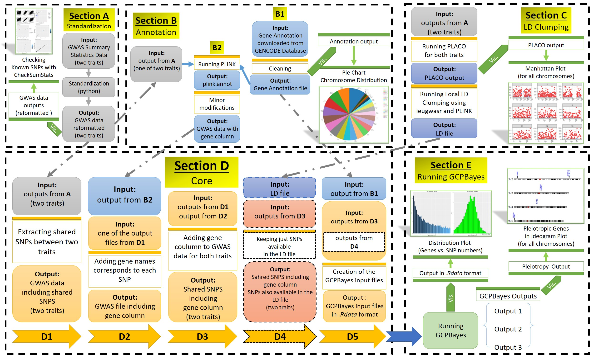

# GCPBayes Pipeline
Created by: Yazdan Asgari 
Creation date: 14 Jan 2022 
Update: Jul 2022 
https://cesp.inserm.fr/en/equipe/exposome-and-heredity
 
 

### Here we have provided detailed information about how to work with the *GCPBayes pipeline* including tips and suggestions. 
 

## NOTES
**IMPORTANT NOTE 1:** All SNPs and genes positions in the GWAS and annotation data are based on GRCh37 (hg19) Human Genome Assembly.
  
**IMPORTANT NOTE 2:** The Section names that are mentioned in this page are correspondence to Figure provided in [An Overview of the Pipeline](#An-Overview-of-the-Pipeline) section in the current page.
 
 
## Installation
1. Make sure all required packages/software have been installed on your system [Link](#Required_Packages_Software)
2. Change the parameters on the *"parameters.ini"* file. [Link](0_Bash)
3. Run the *"run_test_set"* [Link](0_Bash) bash file using the following command:
~~~
$ ./run_test_set.sh parameters_Strategy_bcac_ocac_test_set.ini
~~~
**NOTE:** You might need to change the permission of the BASH file in order to be executed.
~~~
$ chmod 777 run_test_set.sh
~~~
4. For running each section individually, use the source codes on the *"0_Codes"* folder [Link](0_Codes) and follow the tutorial provided in the [**"Tutorial"** section](2) or the [**"Wiki"** section](3)
5. You could run the [**"Test Dataset"**](#Test-Dataset) for running a small example file to test the pipeline.
## Usage
This file includes **THREE** major sections:
- [**Description of Bash Files**](1) (plain text files that contain a series of commands) for running the whole procedure with a series of options. 
**IMPORTANT NOTE:** The Bash file was tested on a Unix-based server with CentOS 7.

- [**A Step-by-Step Tutorial**](2) for how to use the GCPBayes pipeline to explore genes with potential pleiotropic effects on Breast and Ovarian cancers using GWAS summary statistics data of Breast (BCAC) and Ovarian (OCAC) cancers (which their results were presented in the manuscript). 
**IMPORTANT NOTE:** This tutorial could be run on all Operating Systems (OS) including Windows, Linux, and Mac.

- [**GCPBayes Pipeline Wiki**](3) for All Scripts which includes detailed information for all scripts used in the pipeline. 
**IMPORTANT NOTE:** This part includes all concepts and information for each scripts used in the GCPBayes pipeline in order to provide an option to modify/add/remove any part by a user based on its strategy.

## An Overview of the Pipeline
A general overview of the main sections of the GCPBayes pipeline are as follow:
  
<kbd>  </kbd>
  

## Test Dataset
Here, we provide a small dataset for testing the Pipeline. The data are GWAS summary statistics for The Breast Cancer Association Consortium (BCAC) and The Ovarian Cancer Association Consortium (OCAC) chromosome #5 and we want to run the Pipeline (without LD clumping method) and GCPBayes at a gene-level. For running the pipeline in the test set, please perform the following steps:
- Download INPUT files [Download](http://marge11.vjf.inserm.fr/ExpHer_shared/)
  - BCAC and OCAC GWAS data on chromosome #5 (*gwas_BCAC_chr5.txt*, *gwas_OCAC_chr5.txt*)
  - An annotation file including all coding genes (*annot_gencode_v38lift37_modified_gene_class.txt*)
  - BCAC GWAS file with a gene column (*Annot_BCAC_2020_onco_ALL_reformatted_coding.txt*)
- Download the scripts and put them in the same folder as input data [Download](0_test_dataset)
  - *C1_code_find_common_snps_one_pair.R*
  - *C2_code_run_PLACO_decor_one_pair.R*
  - *C3_code_ldclumping_local.R*
  - *D1_code_pipeline_annot_coding_withoutldclumping_extra_info.R*
  - *D2_code_pipeline_annot_coding_ldclumping_extra_info.R*
  - *D3_code_separate_groups_length_threshold.R*
  - *E1_code_gcpbayes_less_extra_info.R*
  - *E2_code_gcpbayes_greater_extra_info.R*
- Download the parameter file (*parameters_Strategy_bcac_ocac_test_set.ini*) [Download](0_test_dataset)
  - You **just** need to change this file for running. So, change the following **PATHS** based on your system paths:
    - working directory
    - Input files - datasets
    - Input files - annotation
- Download the BASH file (*run_test_set.sh*) [Download](0_test_dataset)
- Now, all you need is to run the following command in the terminal:
~~~
$ ./run_test_set.sh parameters_Strategy_bcac_ocac_test_set.ini
~~~
**NOTE:** You might need to change the permission of the BASH file in order to be executed.
~~~
$ chmod 777 run_test_set.sh
~~~
- OUTPUT files
  - *C1_output_BCAC_common_OCAC.txt*
  - *C1_output_OCAC_common_BCAC.txt*
  - *D1_output_pipeline_BCAC_common_OCAC_coding_withoutclumping.txt*
  - *D1_output_pipeline_OCAC_common_BCAC_coding_withoutclumping.txt*
  - *D1_output_pipeline_SNP_in_genes_output_pipeline_BCAC_OCAC_coding_withoutclumping.txt*
  - *D1_Summary_SNP_in_genes_output_pipeline_BCAC_OCAC_coding_withoutclumping.txt*
  - *D1_Summary_SNP_in_genes_output_pipeline_OCAC_BCAC_coding_withoutclumping.txt*
  - *D1_Matrices_output_pipeline_BCAC_OCAC_coding_withoutclumping.Rdata*
  - *D1_Matrices_extra_info_output_pipeline_BCAC_OCAC_coding_withoutclumping.Rdata*
  - *E1_output_GCPBayes_BCAC_OCAC_without_ldclumping_less_threshold_700_results.txt*
  - *E1_output_GCPBayes_BCAC_OCAC_without_ldclumping_less_threshold_700_pleiotropy.txt*

**Running Time:** It took about **3 minutes** to run the *pipeline before GCPBayes* (in a system with Intel Core i7 11th Gen 2.8 GHz with 16 GB RAM). For the *GCPBayes*, we just use the first 50 genes from the data and it took **2 minutes** to run and found any potential pleitropic signal among them.

**Note:** During running GCPBayes, a user could check these two file to see the results:
- *E1_output_GCPBayes_BCAC_OCAC_without_ldclumping_less_threshold_700_results.txt*
- *E1_output_GCPBayes_BCAC_OCAC_without_ldclumping_less_threshold_700_pleiotropy.txt*

## Required Packages_Software
For using the whole functionality of the GCPBayes pipeline, a user should install the following packages/software on the system:
- R Packages
  - BiocManager
  - vroom
  - data.table
  - devtools
  - MASS
  - PLACO
  - genetics.binaRies
  - tidyverse
  - tictoc
  - GCPBayes
  - BhGLM
  - splitstackshape
  - ieugwasr
  - gwasrapidd
  - CheckSumStats
  - plotly
  - patchwork
  - biomaRt
  - regioneR
  - karyoploteR
  - readxl
- Python Packages
  - defaultdict
  - stats
  - datetime
- PLINK
## How to Cite
Asgari et al., "GCPBayes Pipeline: a tool for exploring pleiotropy at gene-level", xxxx. xxx x;x(x), doi:xxx [Link](https://..../)
 
 
